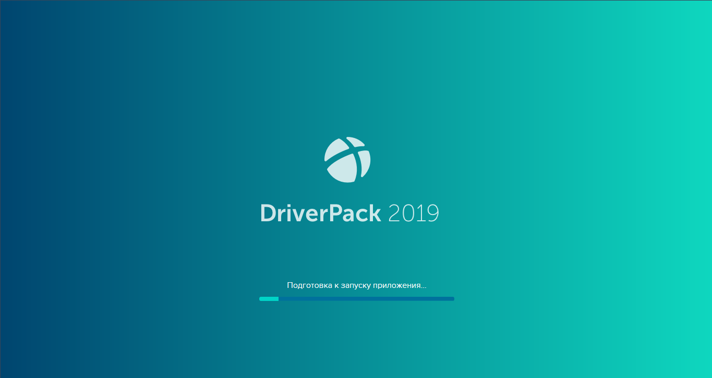
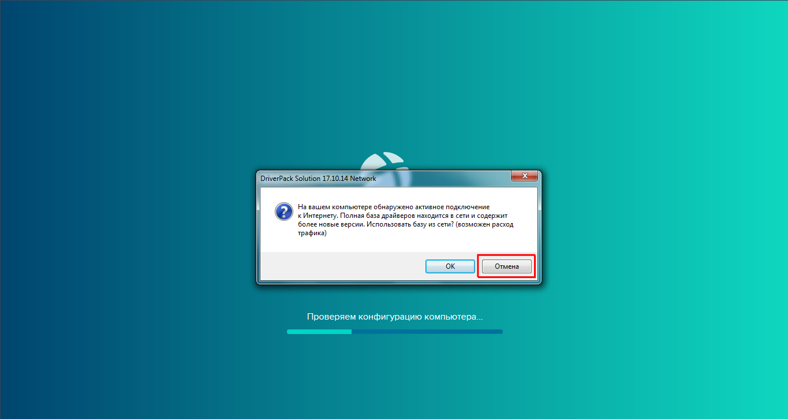
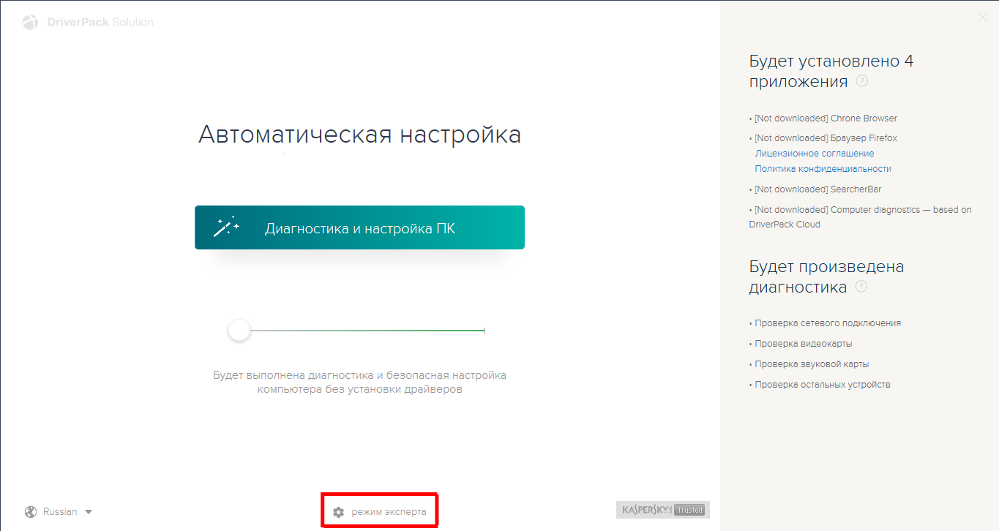
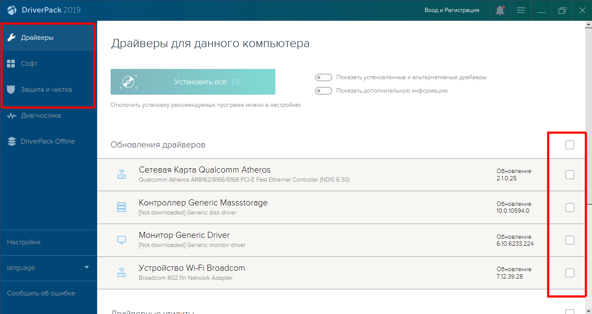

#  Driver-Pack-Solution-2019

---

&nbsp;&nbsp;&nbsp;

---

* [Russian Text](#RussianText)
* [English Text](#EnglishText)

---

##  Driver-Pack-Solution-2019

**Driver Pack Solution** - оффлайн версия наиболее старой утилиты с новой базой драйверов, предназначенная для автоматического поиска, установки и обновления драйверов для сетевого оборудования. 

## Оглавление

1. [Введение](#Intro)
2. [Скачивание](#Downloads)
3. [Использование](#Uses)
4. [Обо мне](#About)

## <a name="Intro">Введение</a>

Современный **Driver Pack Solution** чаще всего принудительно устанавливает левые программы, от которых потом сложно избавиться. Эти же непонятные приложения засоряют систему и мешают нормальной её работе. А порой и вовсе устанавливают в систему что-нибудь вирусное или то, что не отмечено пользователем, т.е. с помощью скрытой установки.

Чтобы избавиться от всех проблем, решено было внедрить новую базу драйверов в наиболее старую версию данной утилиты, которая могла адекватно управляться со стороны пользователя. Версия утилиты была выбрана не случайно - чтобы базы данных старой версии и новой были совместимы. Таким образом, принудительно всё что не отмечено галочками никогда не будет установлено, в отличие от любой версии, которую вы можете скачать [официального сайта](https://driverpaksolution.ru/ "Driver Pack Solution").

---

[К оглавлению](#Oglavlenie)

---

## <a name="Downloads">Скачивание</a>

Скачать данную утилиты вы можете по следующей ссылке: [Release-версия утилиты](https://github.com/maximalisimus/Driver-Pack-2019/releases) для данного Github репозитория.

---

[К оглавлению](#Oglavlenie)

---

## <a name="Uses">Использование</a>

Сразу после скачивания последней версии утилиты из раздела **Release** распакуйте **SFX** архив и запустите файл **&laquo;DriverPack.exe&raquo;**.

После того, как увидите вопрос утилиты об использовании зеркала базы из сети - обязательно ответьте **&laquo;Нет&raquo;** или **&laquo;Отмена&raquo;**!

Теперь внизу по центру экрана выберите **&laquo;Режим эксперта&raquo;**.

Обязательно пройдитесь по всем вкладкам и снимите все галочки, чтобы кнопка установки была пустой.

Теперь можете выбрать один единственный драйвер для вашего сетевого оборудования и можете быть на 100500% уверены, что в данной установке - ничего кроме драйвера не будет устанавливаться.

Можно нажимать кнопку установки.

---

[К оглавлению](#Oglavlenie)

---

## <a name="About">Обо мне</a>

	
Подробнее ...

	
Автор данной разработки **Shadow**: [maximalisimus](https://github.com/maximalisimus).

Имя автора: **maximalisimus**: [E-Mail](mailto:maximalis171091@yandex.ru).

Дата создания: **16.05.2023**

---

[К оглавлению](#Oglavlenie)

---

##  Driver-Pack-Solution-2019

**DriverPack Solution** — offline version of the oldest utility with a new driver database, designed to automatically find, install and update drivers for network equipment. 

**Table of contents**

1. [Introduction](#IntroEng)
2. [Downloads](#DownloadsEng)
3. [Uses](#UsesEng)
4. [About](#AboutEng)

## <a name="IntroEng">Introduction</a>

Modern **Driver Pack Solution** most often forcibly installs unauthorized programs which are difficult to get rid of later. These strange applications clog up the system and interfere with its normal operation. And sometimes they install to the system something viral or something that is not marked by the user, i.e. using hidden installation.

To get rid of all the problems, it was decided to add a new driver base to the oldest version of this utility, which could be adequately handled by the user. The version of the utility was not chosen randomly - so that the databases of the old version and the new one would be compatible. Thus, forcibly everything that is not checked will never be installed, unlike any version that you can download [official site](https://driverpaksolution.ru/ "Driver Pack Solution").

---

[To the table of contents](#EngOglavlenie)

---

## <a name="DownloadsEng">Downloads</a>

You can download this utility from the following link: [Release-version of the utility](https://github.com/maximalisimus/Driver-Pack-2019/releases) for this Github repository.

---

[To the table of contents](#EngOglavlenie)

---

## <a name="UsesEng">Uses</a>

Immediately after downloading the latest version from **Release**, unzip **SFX** archive and run **&laquo;DriverPack.exe&raquo;** file.

After you see the utility's question about using a base mirror from the network - be sure to answer **&laquo;No&raquo;** or **&laquo;Cancel&raquo;**!

Now select **&laquo;Expert Mode&raquo;** at the bottom center of the screen.

Be sure to go through all the tabs and uncheck all the checkboxes so that the install button is blank.

Now you can select one single driver for your network hardware and you can be 100500% sure that in this installation - nothing but the driver will be installed.

You can click the install button.

---

[To the table of contents](#EngOglavlenie)

---

## <a name="AboutEng">About</a>

	
More detailed ...

The author of this development **Shadow**: [maximalisimus](https://github.com/maximalisimus).

Author's name: **maximalisimus**: [E-Mail](mailto:maximalis171091@yandex.ru).

Date of creation: **16.05.2023**

---

[To the table of contents](#EngOglavlenie)

